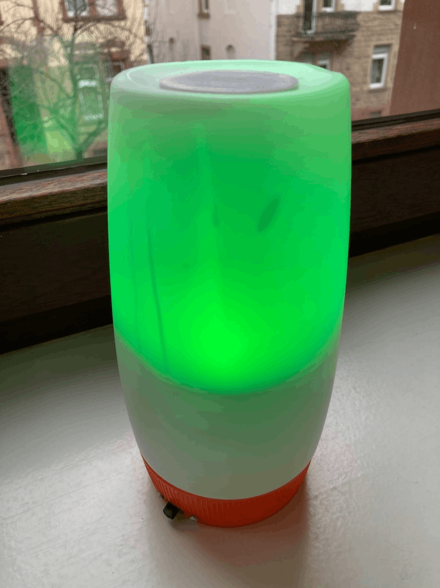
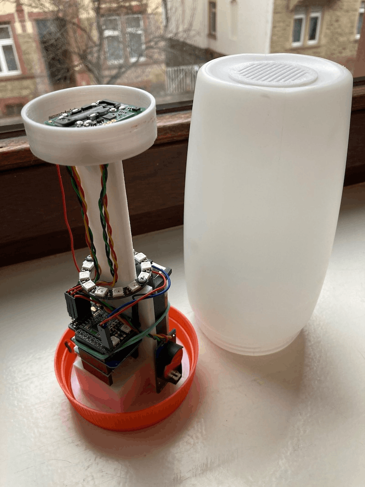
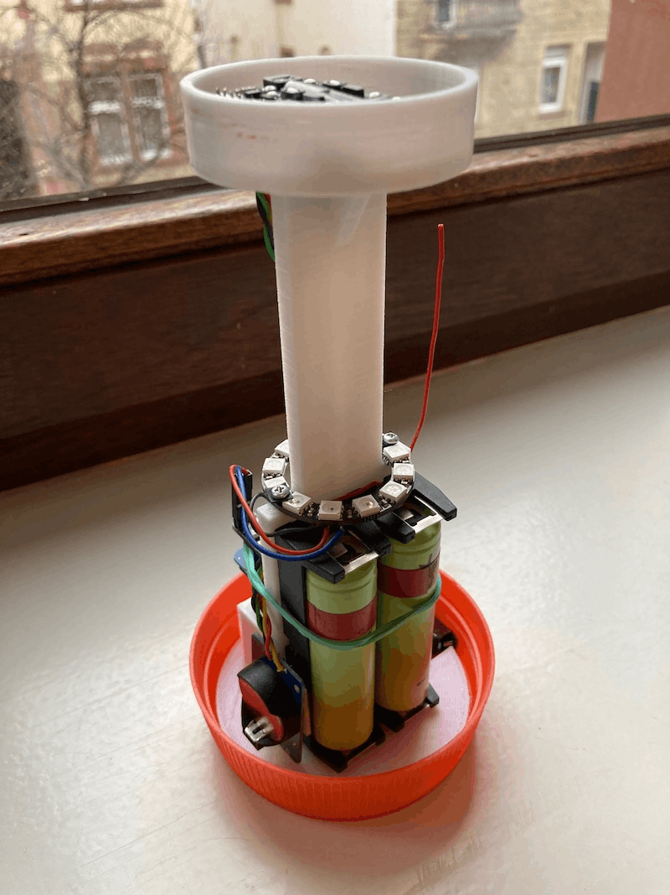
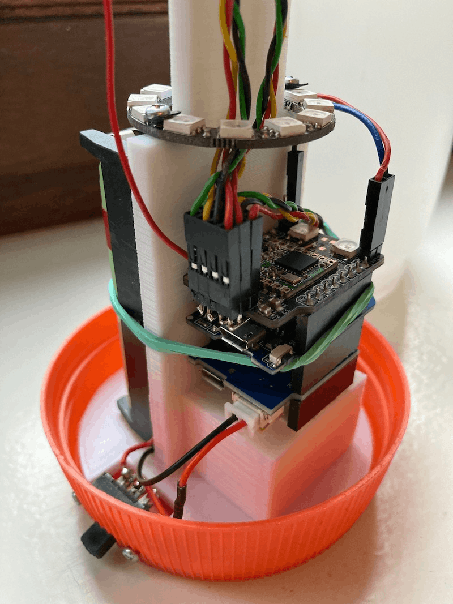
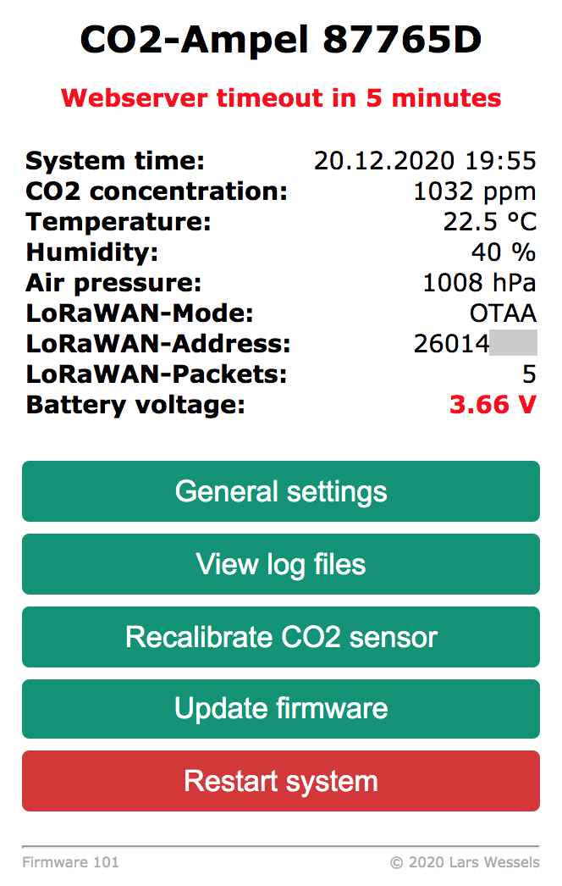

## CO2-Ampel

Yet another CO2-Ampel based on an ESP8266 (Wemos D1 mini) to continuously
measure CO2 concentration indoors with a [SCD30](https://www.sensirion.com/en/environmental-sensors/carbon-dioxide-sensors/carbon-dioxide-sensors-CO2/) CO2 sensor accompanied by a [BME280](https://www.bosch-sensortec.com/products/environmental-sensors/humidity-sensors-bme280/)
for temperature, humidity and air pressure readings. Current air condition
(good, medium, critical, bad) is shown using a NeoPixel ring with WS2812
LEDs illuminating the device in either green, yellow or red.

Unlike other devices this one runs on two 18650 Li-Ion batteries, offers
a sophisticated web interface for configuration, live sensor readings
and OTA firmware updates. Sensor data can be logged to local flash
(LittleFS), retrieved RESTful, published using MQTT or even transmitted
with LoRaWAN if a [RFM95 shield](https://github.com/hallard/WeMos-Lora)
is installed.

## Hardware components

* [SCD30 CO2 sensor](https://www.sensirion.com/en/environmental-sensors/carbon-dioxide-sensors/carbon-dioxide-sensors-CO2/)
* [BME280 break-out board](https://www.aliexpress.com/wholesale?SearchText=bme280&opensearch=true)
* [Wemos D1 mini board](https://escapequotes.net/esp8266-wemos-d1-mini-pins-and-diagram/)
* [Wemos Battery Shield](https://www.wemos.cc/en/latest/d1_mini_shield/battery.html)
* [Wemos ProtoBoard Shield](https://www.wemos.cc/en/latest/d1_mini_shield/protoboard.html) or
[LoRa Shield](https://github.com/hallard/WeMos-Lora)
* [DS3231 AT24C32 RTC Module](https://de.aliexpress.com/w/wholesale-ds3231.html)
* [NeoPixel ring with 12 WS2812 LEDs](https://www.aliexpress.com/w/wholesale-rgb%20led%20ring%2012%20bits%20ws2812.html)
* 3-pin slide switch
* 2 x 18650 rechargeable Li-Ion cells
* 2 x single-slot 18650 battery holders
* 5 x Dupont cables with female connector (3 x 4-pin, 1 x 2-pin, 1 x 1-pin)
* 2pin JST PH2.0 female plug
* 2.54mm single row pin headers for Dupont connectors

Looking around for a suitable housing for the CO2-Ampel we (my son and I)
spontaneously choose [this](https://www.ovomaltine.de/produkte/ovomaltine-pulver-dose)
because it was almost empty, pretty robust and seemed perfect in respect
to shape and size. :wink:

To help stack all components inside the translucent plastic tin I designed
a  simple [3D printed inner frame](3d-parts/inner-frame.png) which has a
place for all components and is  glued into the orange lid. The SCD30 and
BME280 sensors are placed into a seperate [3D printed sensor-mount](3d-parts/sensor-mount.png)
which is glued on top of the frame **after** the NeoPixel ring has been screwed
onto the frame. Air ventilation is achieved by a [3D printed grille](3d-parts/ventilation_grille.png)
pressed into a 40 mm hole cut into the rather thick bottom of the
plastic tin.

## Putting it all together

All Wemos components are simply stacked together. The battery shield is
placed at the bottom, the Wemos D1 mini in the middle and the (optional)
LoRa shield on top. The I2C connector of the LoRa shield was extended
with two more 4-pin headers to connect the three I2C modules (SCD30,
BME280, DS3231). Alternatively you can replace the LoRa shield with a
Wemos ProtoBoard shield and solder the three 4-pin headers in parallel
to D1 (SCL), D2 (SDA), 3.3V and GND on top of the board. If you're using
a ProtoBoard you also have to add two 4.7k pull-up resistors from D1 and D2
to 3.3V or I2C communication will proably fail.

The SCD30 CO2 sensor, BME280 break-out board and DS3231 RTC are each
soldered to 4-pin Dupont cables which in turn connect to the 4-pin I2C
header on either the LoRa or a Wemos ProtoBoard shield. Double check
that all SCL pins are connected to D1 and all SDA pins to D2. The Vcc
input of all I2C modules **must** be connected to 3.3V of the Wemos stack
and **not 5V** or you'll destroy all I2C components in no time!

The Vin pin of the NeoPixel ring must be connected to 5V, its data input
port to GPIO0 and GND to GND of the Wemos shield stack. I used a 2-pin
Dupont cable for 5V and GPIO0 and a 1-pin cable for GND to connect the
ring to the 2.54mm pin headers soldered onto the LoRaWAN shield. If you're
using a Wemos ProtoBoard you probably want to merge GPIO0, 5V and GND
into a single 3-pin header.

The two 18650 battery holders are wired in parallel and are connected to
the Wemos battery shield using a JST PH2 female plug. A rubber band will
prevent the Li-Ion cells from becoming loose. The Vcc line is looped
through the slide switch mounted into the orange lid serving as the
external power switch.

Two 3400mAh Li-Ion cells will last for about two 9-to-5 working days. If
the voltage falls belows 3.55V the CO2-Ampel will enter deep sleep to
protect the cells from deep discharge. It will then wake up once every
hour, flash red six times before returning to deep sleep again. You can
configure a simple daily scheduler to adjust operating times to your needs.

The Li-Ion batteries can either be changed if empty or charged using the
micro usb port connected on the Wemos battery shield. On the bottom of
the battery shield you can choose to close a solder bridge (J1) to
increase charging current from 0.5A to 1A. Since only recent Wemos
battery shields (v1.3) offer a solder bridge (J2) to connect the battery
Vcc to A0 of the Wemos board (using a 120k resistor) you need to add
a resistor (100-220k) yourself from the Vcc pin of the JST male connector
on the shield to the A0 pin to enable voltage monitoring.

## Compiling the firmware

First adjust settings in `config.h` according to your needs (language) and hardware
setup. For an initial setup you should probably leave the default setttings
untouched since most of them can be changed anyway using the extensive
web interface and are then stored in the EEPROM of the DS3231 RTC module.
Only support for the optional [LoRa Shield](https://github.com/hallard/WeMos-Lora)
shield must be explicitly enabled by uncommenting `HAS_LORAWAN_SHIELD`.
Same holds true for the parameter `VBAT_ADJUST` which sets the multiplier
for the voltage divider used on the A0 input of the ESP8266 to measure
the battery voltage on the Wemos battery shield's JST battery connector.

Before trying to compile and flash the sketch to your Wemos D1 mini make
sure that you [added support for ESP8266 based boards](https://github.com/esp8266/Arduino)
and the following libraries have been installed. Don't be too intimidated
by the long list, the [Arduino IDE library manager](https://www.arduino.cc/en/Guide/Libraries)
will give you a hand. Make sure that you set the flash size to `4MB (FS:2MB OTA:~1019k)`
to spare flash for the logging. To save battery set the CPU-Frequency to `80 MHz`.

* [EPS8266Wifi](https://github.com/esp8266/Arduino/tree/master/libraries/ESP8266WiFi)
* [ESP8266WebServer](https://github.com/esp8266/Arduino/tree/master/libraries/ESP8266WebServer)
* [ESP8266HTTPUpdateServer](https://github.com/esp8266/Arduino/tree/master/libraries/ESP8266HTTPUpdateServer)
* [ESP8266mDNS](https://github.com/esp8266/Arduino/tree/master/libraries/ESP8266mDNS)
* [uEEPROMLib](https://github.com/Naguissa/uEEPROMLib)
* [RTClib](https://github.com/adafruit/RTClib)
* [FastLED](https://github.com/FastLED/FastLED)
* [PubSubClient](https://github.com/knolleary/pubsubclient/releases)
* [ArduinoJson](https://arduinojson.org/)
* [BME280I2C](https://github.com/finitespace/BME280)
* [MCCI LoRaWAN LMIC Library](https://github.com/mcci-catena/arduino-lmic)
* [LittleFS](https://github.com/esp8266/Arduino/tree/master/libraries/LittleFS)
* [NTPClient](https://github.com/arduino-libraries/NTPClient)
* [RunningMedian](https://github.com/RobTillaart/RunningMedian)
* [Time](https://github.com/PaulStoffregen/Time)
* [Timezone](https://github.com/JChristensen/Timezone)

You only need to upload the firmware from the Arduino IDE to the Wemos D1 mini
using its micro USB connector once. For further updates just use the *Export compiled
Binary* option under the *Sketch* menu in the Arduino  IDE and upload the binary
using the firmware update option in the web interface.

## Initial startup

After flashing the firmware onto a hopefully working hardware setup you
should enable the serial monitor in the Arduino IDE to closely monitor
the startup process and initial operation of the CO2-Ampel.

Right after power up you'll see two white flashes inidicating a successful
inialization of all components connected to the I2C bus, followed by two
green flashes showing a successful initialization of the RTC module. An
error at this stage will result in continous red flashing...time to check
all connections.

If you compiled in support for the optional LoRa shield and also enabled
OTAA by defining `LORAWAN_USEOTAA` in `config.h` the CO2-Ampel will now
try to connect to a LoRaWAN gateway with a timeout of 10 seconds. During
OTAA it will flash magenta followed be two green flashes if the network
join succeeded. LoRaWAN session keys and settings are stored in EEPROM
and reused on next power up. An OTAA failure will trigger two red flashes.

Next WiFi is turned on (two blue flashes), a local access point is fired
up (two green flashes) and a webserver is started to further configure
the devices and show current sensor readings. If you enabled the optional
WiFi uplink in `config.h` a few LEDs will now turn blue while trying
to connect to the WiFi network specified with `WIFI_STA_SSID` and
`WIFI_STA_PASSWORD`. On success you'll see two green flashes otherwise
red. You need to connect the CO2-Ampel to a local WiFi (with internet
access) at least once to initially set its RTC.

If a WiFi uplink is available and MQTT is enabled the CO2-Ampel will
initially connect to the configured MQTT broker. A successlful
initialization of the MQTT uplink is indicated by two orange flashes.

The initial setup ends with a few more green flashes indicating the
successful initialization of the SCD30 and BME280 sensor modules. At
last the CO2-Ampel will switch to white for about a minute giving the
SCD30 time to warm up. Eventually monitoring of the CO2 concentration
will start indicated by a continous green (good), yellow (medium) or
red (bad) illumination. If you start to see two repeating red flashes
the air condition is critical...time to open the windows!

Continous four red flashes indicate repeated errors while trying to
get valid CO2 readings from the SCD30 sensor. Turning the
CO2-Ampel off for a few seconds will usually fix this.

If the reset button on the Wemos D1 mini is pressed all settings are
reset to their default values as set in `config.h` at compile time.

## Adjust device settings

During the initial setup phase the CO2-Ampel will start a WiFi access
point with the SSID `CO2-Ampel` followed by six alphanumeric characters
derived from the Wemos D1 mini's MAC address. You can connect to the access
point within a timeout initilially set to 10 minutes using the password
specified by `WIFI_AP_PASSWORD` (default is `__mysecret__`). Then point
your favorite browser to `http://192.168.4.1` and you'll be presented an
extensive web interface to further configure your CO2-Ampel.
Its language is preset at compile time by either defining `LANG_DE` or
`LAND_EN` in `config.h`. All settings are saved in the EEPROM of the RTC
module and will thus survive a power off.

## CO2 sensor calibration

Since the SCD30 CO2 sensor has to be exposed to fresh air for at least
one hour every day to make its automatic self-calibration (ASC) work as
expected, it has been disabled in this setup. The SCD30 is pre-calibrated
at the factory, but the accuracy (approx. +- 60 ppm, drift approx. 80 ppm/year)
may change e.g. due to mechanical effects during transport.

However the CO2 sensor can be manually (re)calibrated in fresh air (outdoor
air is actually between 350 ppm and 450 ppm in normal geographic locations)
using its forced recalibration (FRC) command which can be triggered in the
web interface. Just place the CO2-Ampel into (windless) fresh air, start
the calibration process (CO2-Ampel will switch to cyan color) and keep an
eye on the web interface. The fully automated calibration might take a few
minutes since the CO2-Ampel now continously monitors the standard deviation
of the CO2 readings. It will only set a new reference value (410 ppm) if
the readings are more or less stable. This value can be changed in `sensor.h`
with `SCD30_CO2_CALIBRATION_VALUE`.

If CO2 readings still keep floating within a timeout of 5 minutes the
calibration is eventually aborted, keeping the previous reference value.
The CO2-Ampel will flash red for 15 seconds to indicate calibration failure.

The temperature offset between the onboard RH/T sensor and the BME280 is
continously corrected automatically based on their standard deviation.
Intial offset is set to 1.9 in `sensors.h` with `SCD30_TEMP_OFFSET`.

## Disclaimer

Even though this device consists more or less of the same components as professional
systems it does not have any certification. It's a home made product for
educational purposes and thus cannot be used as medical device or serve
as personal protective equipment in the sense of any legislation.

## Contributing

Pull requests are welcome! For major changes, please open an issue first to
discuss what you would like to change.

## License

Copyright (c) 2020-2021 Lars Wessels  
This software was published under the Apache License 2.0.  
Please check the [license file](LICENSE).
